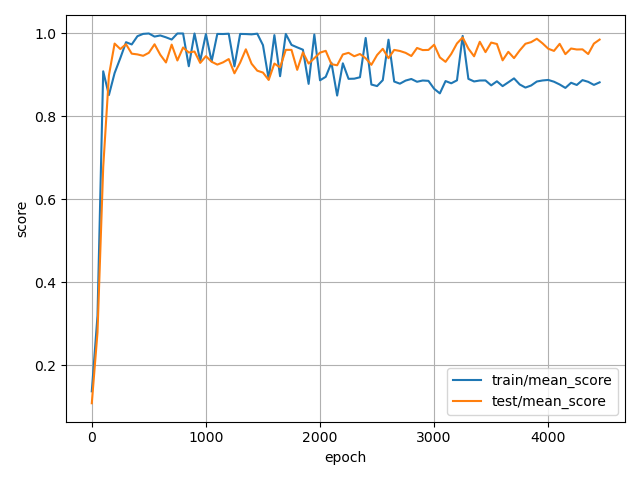
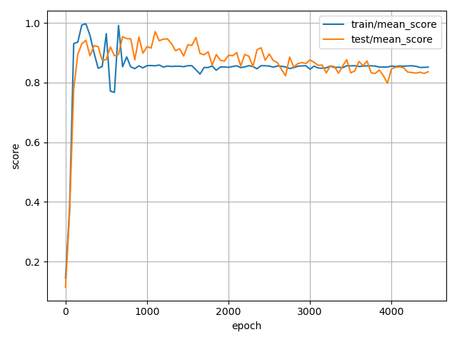
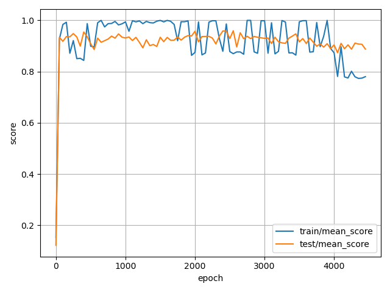
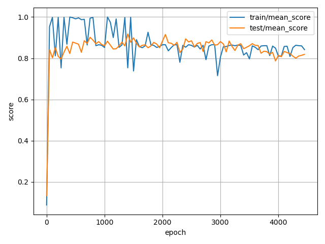
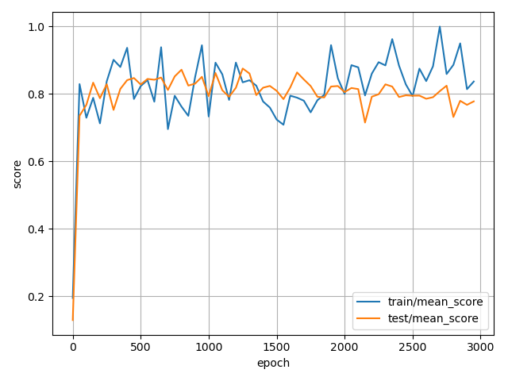
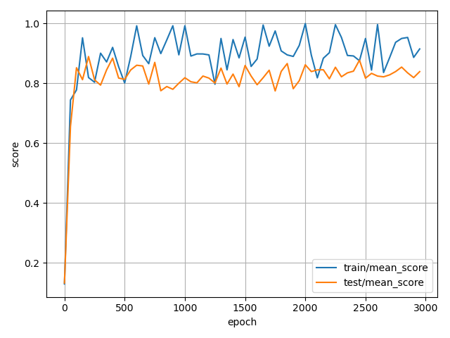

## Overview

The evaluation of the trained policies is mainly done via the `eval.py` script from `real-stanford/diffusion_policy`. Following the approach described in the paper, I evaluated the last **10** checkpoints (saved every 50 epochs) across **50** environment initailizations. Due to resource limitations, only one policy model is trained instead of three from different training seeds for each experiment setup. The mean score, coverate, and success rate are calculated and reported using the following command:

```sh
python scripts/eval.py --exp PATH_TO_OUTPUT
```

### Issue with Evaluation Metric

A mismatch is discovered between the metrics reported in the paper and from the evaluation script. In the original paper, the Push-T task uses "**target area converage**" as the metric. On the other hand, the metric provided by the evaluation script is **mean score**.

The definition of mean score is the average of the maximum rewards in each episode. The reward is calculated by the intersection area of the goal and block pose over the goal area, then again divided by the success threshold (0.95 in this case) and clipped to $[0, 1]$. Refer to the following pseudo code for implementation:

```python
intersection_area = goal_geom.intersection(block_geom).area
goal_area = goal_geom.area
coverage = intersection_area / goal_area
reward = np.clip(coverage / self.success_threshold, 0, 1)
done = coverage > self.success_threshold
```

The problem is that the `clip` operation is nonlinear, hence one cannot calculate the average target area converage from the reward or mean score along. In addition, the coverage metric cannot be retrieved without modifying the environment runner source code. This results in confusion on whether the evaluation script provided was used to calculate the metrics reported. In order to align with the paper, an additional patch is applied to calculate both target area coverage and mean score.

## Results

The evaluation results of the policies are provided in the table below, along with the training curves as well.

| Observation | Dataset | Model       | Mean Score | Coverage | Success Rate | Time Taken |
|-------------|---------|-------------|-----------:|---------:|-------------:|-----------:|
| Keypoints   | v1      | Transformer |     0.9472 |   0.9058 |       0.6540 |     6h 17m |
| Keypoints   | v2      | Transformer |     0.8329 |   0.7953 |       0.5740 |     6h 55m |
| Keypoints   | v1      | CNN         |     0.9079 |   0.8719 |       0.7240 |     7h 17m |
| Keypoints   | v2      | CNN         |     0.8184 |   0.7826 |       0.5160 |     8h 11m |
| Image       | v1      | CNN         |     0.7995 |   0.7643 |       0.3700 |    31h 52m |
| Image       | v2      | CNN         |     0.8296 |   0.7937 |       0.4840 |    41h 05m |

| Obervation | Model       |                         Dataset V1                          |                         Dataset V2                          |
|------------|-------------|:-----------------------------------------------------------:|:-----------------------------------------------------------:|
| Keypoints  | Transformer |  |  |
| Keypoints  | CNN         |          |          |
| Image      | CNN         |              |              |

## Discussions

### Training Dynamics

From the training dynamics plot provided above, a weird pattern is observed. In keypoint-based experiments, training curves present an overfitting-like pattern, where the scores are high at approximately the 1000th epochs, but then dropped to a lower level. Likewise, validation curves also tend to decay in the second half of the training, though the drop is less significant than the training ones. Image-based experiments, on the other hand, present a more "expected" training dynamics, where the scores rise quickly at the beginning and then gradually stabilize. Also note that the variance of the scores is much higher than the keypoint-based experiments.

Overfitting is usually detected by the decaying validation score. However, in the keypoint-based experiments, it is the training score that decays. One possible reason is that the training set evaluation has a lower number of environments, which is 7 compared to 50 in the test set. This would lead to a higher sensitivity to noise and randomness, and thus a higher variance in the training score, which matches the observation.

### Observation

Policies trained on image-based observations perform worse than the ones trained on keypoint-based observations, which matches the observation in the paper. Intuitively, keypoints can be understood as an intermediate representation or a feature of the image. Models without needing to learn the image representation can focus more on learning the policy, thus achieving better results.

### Dataset

In the [data analysis notebook](data_analysis.ipynb), the properties of the two datasets can be summarized as:

- Size: v2 is double the size of v1.
- Collection: v1 is a subset of v2.
- Quality: both datasets have similar quality in terms of reward and success rate.

Thus, the most significant difference between the two is the size.

Naturally, it is expected that more data leads to better generalization and better results. However, the experiment results contradict with the aforementioned claim. In keypoint-based experiments, policies trained with v1 performed better than v2. On the other hand, image-based experiments matches the scaling law. One possible reason is the overfitting pattern discussed in previous sections. Even if the dataset size is doubled, the number of training episodes is still low, 103 and 206 respectively. The large number of training epochs might easily lead to overfitting regardless of the dataset size difference. Evaluation on the best-performing checkpoints instead of the last ones might provide additional insights to this.

### Model Architecture

Comparison between model architectures can be done via looking at the keypoint-based experiments. In the paper, the CNN models have a slight lead over the Transformer models in the Push-T task. However, my experiment results contradict with the observation. Further investigation is needed to understand the reason behind this.

## Conclusion and Future Work

This work is an attempt to reproduce the results in the paper "Diffusion Policy: Visuomotor Policy Learning via Action Diffusion". The evaluation results are worse than the numbers reported in the paper, and several inconsistencies are discovered. However, due to the time and resource constraints, the experiments are not able to provide a comprehensive analysis. Future work can be done to investigate the following aspects:

- Training on the original dataset instead of the custom one.
- Evaluation on the best-performing checkpoints instead of the last ones.
